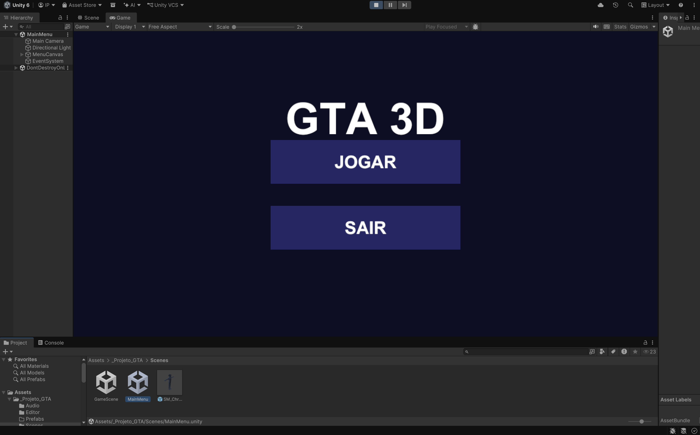
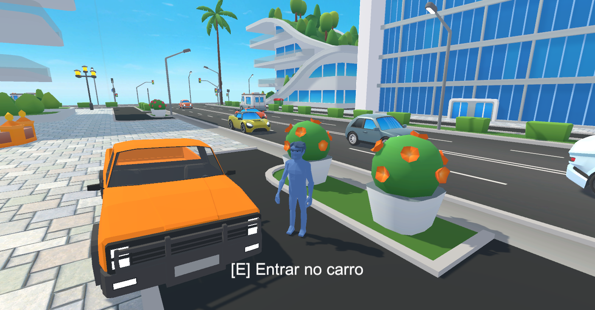
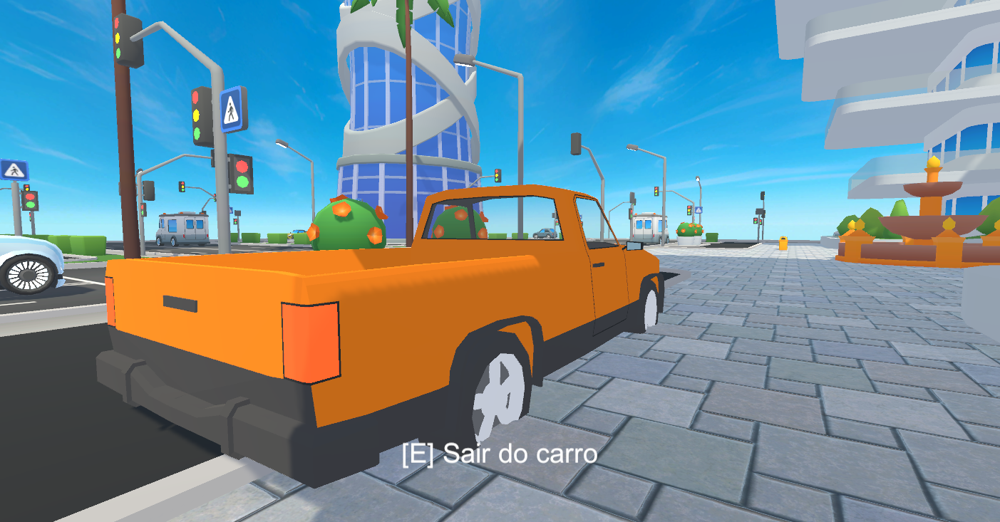

# GTA 3D — Open World Racing

> Trabalho acadêmico — Disciplina de Desenvolvimento de Jogos · Unity 6

## Descrição

**GTA 3D** é um jogo de mundo aberto em terceira pessoa desenvolvido em Unity 6 com pipeline Built-in. O jogador explora uma cidade low-poly, caminha pelas ruas com animações de idle/corrida e pode entrar em um carro para dirigir livremente pelo cenário. A câmera orbital segue o personagem ou o veículo com controle suave pelo mouse, e o jogo conta com menu principal com música de fundo e sistema de pausa.

---

## Controles

| Ação | Tecla |
|------|-------|
| Mover | WASD |
| Câmera | Mouse |
| Correr | Shift |
| Pular | Espaço |
| Entrar / Sair do carro | E |
| Pausar | Esc |
| Screenshot | F12 |

---

## Gameplay (Vídeo)

> 🎬 **[Clique aqui para assistir ao gameplay (Google Drive)](https://drive.google.com/file/d/1XlgPaYO9wEOuRvmkG0lH4xhU0Cbmhk1C/view?usp=share_link)**

---

## Screenshots

**Menu Principal**



**Personagem andando pela cidade**



**Dirigindo o carro**



---

## Funcionalidades Desenvolvidas

### 1. Movimento em 3ª Pessoa (`ThirdPersonPlayerController.cs`)

O sistema de movimento usa um **Rigidbody** para física realista. A direção do movimento é calculada **em relação à câmera** — "frente" é sempre para onde a câmera aponta, não o eixo global Z. Corrida com Shift e pulo com verificação de chão via `SphereCast`. O personagem rotaciona suavemente para a direção do movimento usando `Quaternion.Slerp`.

```csharp
// Direção relativa à câmera, projetada no plano horizontal.
Vector3 camForward = Vector3.Scale(cameraTransform.forward, new Vector3(1, 0, 1)).normalized;
Vector3 camRight   = Vector3.Scale(cameraTransform.right,   new Vector3(1, 0, 1)).normalized;

Vector3 moveDir = (camForward * v + camRight * h);
if (moveDir.sqrMagnitude > 1f) moveDir.Normalize();

bool running = Input.GetKey(KeyCode.LeftShift);
float targetSpeed = running ? runSpeed : walkSpeed;

// Aplica velocidade preservando a componente vertical (gravidade/pulo).
_rb.linearVelocity = new Vector3(
    moveDir.x * targetSpeed,
    _rb.linearVelocity.y,
    moveDir.z * targetSpeed
);

// Rotaciona suavemente o personagem para a direção do movimento.
if (moveDir.sqrMagnitude > 0.001f)
{
    Quaternion target = Quaternion.LookRotation(moveDir, Vector3.up);
    _rb.MoveRotation(Quaternion.Slerp(_rb.rotation, target, rotationSpeed * Time.fixedDeltaTime));
}
```


---

### 2. Entrar e Dirigir o Carro (`VehicleEnterExit.cs` + `CarController.cs`)

Ao pressionar **E** perto do carro, o script detecta a distância, desativa o controle do personagem, parenteia o modelo dentro do veículo e transfere o controle da câmera para seguir o carro. Ao sair, o processo é invertido e o player reaparece ao lado.

```csharp
private void EnterCar()
{
    // Desativa controle do player e oculta o modelo.
    _player.SetControlEnabled(false);
    _playerTransform.SetParent(transform);
    _playerTransform.localPosition = new Vector3(0f, 0.2f, 0f);
    _playerTransform.gameObject.SetActive(false);

    // Ativa o CarController do carro.
    _car.SetControlEnabled(true);

    // Câmera passa a seguir o carro.
    if (_cam != null)
        _cam.SetTarget(transform, new Vector3(0f, 1.2f, 0f));

    _playerInCar = true;
    GameManager.Instance?.SetHint("[E] Sair do carro");
}
```

O `CarController` usa `Rigidbody.AddForce` para aceleração e esterçamento progressivo sem WheelColliders — mais estável para um jogo arcade:

```csharp
// Aceleração na direção frontal do carro.
if (Mathf.Abs(currentSpeed) < maxSpeed)
    _rb.AddForce(transform.forward * accelInput * acceleration, ForceMode.Acceleration);

// Esterçamento proporcional à velocidade.
if (Mathf.Abs(currentSpeed) > 0.5f)
{
    float sign = Mathf.Sign(currentSpeed);
    float steerAngle = steerInput * steerSpeed * sign * Time.fixedDeltaTime;
    _rb.MoveRotation(_rb.rotation * Quaternion.Euler(0f, steerAngle, 0f));
}
```


---

### 3. Sistema de Animações com Blend Tree (`GTAAnimationSetup.cs`)

O personagem utiliza animações **Humanoid** do Mixamo (Idle, Walking, Running) controladas por um **Animator Controller** gerado via script. Um Blend Tree 1D interpola suavemente entre as três animações com base no parâmetro `Speed` (0 = parado · 0.5 = andando · 1 = correndo). O valor de Speed vem da velocidade real do Rigidbody, garantindo que a animação responda corretamente em todas as direções.

```csharp
// Criação do Blend Tree via Editor script (GTAAnimationSetup.cs)
BlendTree blendTree;
AnimatorState locomotionState = ctrl.CreateBlendTreeInController("Locomotion", out blendTree);
blendTree.blendType      = BlendTreeType.Simple1D;
blendTree.blendParameter = "Speed";
blendTree.useAutomaticThresholds = false;

blendTree.AddChild(idle, 0.00f);  // parado
blendTree.AddChild(walk, 0.50f);  // caminhando
blendTree.AddChild(run,  1.00f);  // correndo
```

```csharp
// No ThirdPersonPlayerController.cs — Speed calculado da velocidade real do Rigidbody
float planar = new Vector3(_rb.linearVelocity.x, 0f, _rb.linearVelocity.z).magnitude;
float normalized = Mathf.Clamp01(planar / runSpeed);
// Suavização com dampTime de 0.08s para transições fluidas
_animator.SetFloat(SpeedHash, normalized, 0.08f, Time.fixedDeltaTime);
```


---

## Como Rodar

1. Abra o projeto no **Unity 6** (`6000.4.11f1` ou superior).
2. Importe animações do Mixamo (Idle, Walking, Running — FBX for Unity) em `Assets/_Projeto_GTA/Animations/`.
3. No menu do Unity: **GTA → ★ Rodar Tudo** (configura cenas, player, câmera, carro e animações).
4. Pressione **▶ Play**.

> **Requisito:** o repositório não inclui a pasta `Library/` (gerada automaticamente pelo Unity na primeira abertura).

---

## Assets Utilizados

| Asset | Fonte | Licença |
|-------|-------|---------|
| Cartoon City Free (ithappy) | Unity Asset Store | Free |
| Drivable-Free Low Poly Cars | Unity Asset Store | Free |
| POLYGON - Starter Pack (Synty) | Unity Asset Store | Free |
| Animações de personagem | Mixamo (Adobe) | Free |
| Trilha sonora | Gerada via síntese Python | Royalty-free |

---

## Observação sobre Áudio

> ⚠️ **A música de fundo não aparece nas gravações de tela**, pois o software de captura não capturou o áudio interno do Unity durante a gravação do gameplay.
>
> O arquivo de áudio **existe no projeto** e toca normalmente ao jogar localmente:
> `Assets/_Projeto_GTA/Audio/menu_music.wav`
>
> Para ouvir: abra o projeto no Unity, rode **GTA → ★ Rodar Tudo** e pressione Play — a música inicia automaticamente no menu.

---

## Autor

**Igor Lima Ponce**
